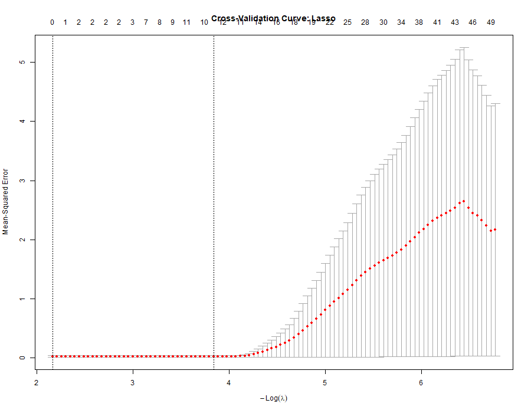
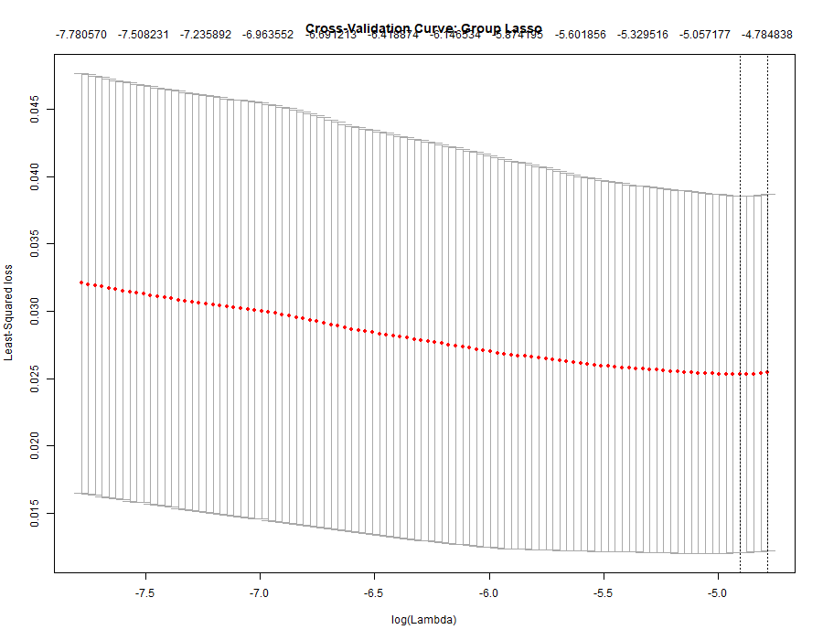

# Gene Expression Regression with Group Lasso

Structured sparse regression for high-dimensional gene expression data using **lasso** and **group lasso** in R.

---

## Overview

This project investigates whether incorporating **known feature group structure** improves predictive performance in high-dimensional regression.

Using the `bardet` gene-expression dataset, we compare:

- **Lasso** (standard sparse regression)
- **Group Lasso** (structured sparsity)

The predictors naturally form **groups of related features (genes)**, making group lasso particularly suitable. 

Full reproducible analysis: [gene_expression_group_lasso_analysis.Rmd](notebooks/gene_expression_group_lasso_analysis.Rmd)

---

## Key Results

| Model        | Correlation | R²    | RMSE  |
|-------------|------------:|------:|------:|
| Lasso       | 0.75        | 0.454 | 0.013 |
| Group Lasso | 0.86        | 0.716 | 0.007 |

📄 Full results: [`results/tables/model_performance.csv`](results/tables/model_performance.csv)

**Conclusion:**  
Group lasso outperforms standard lasso by leveraging the underlying group structure of predictors, leading to improved predictive accuracy and interpretability.

---

## Visual Results

### Lasso Cross-Validation


### Group Lasso Cross-Validation


---

## Why This Matters

High-dimensional biological data (e.g., gene expression) often contain **structured predictors**:

- Genes are represented by multiple correlated measurements  
- Standard methods (lasso) treat predictors independently  
- This can lead to unstable or less interpretable models  

**Group lasso improves:**
- Interpretability (selects entire gene groups)
- Statistical efficiency
- Predictive performance in structured settings

---

## Methodology

1. Load gene-expression dataset (`bardet`)
2. Split data into:
   - 80 training observations
   - 40 testing observations
3. Fit models using **5-fold cross-validation**
   - `glmnet` (lasso)
   - `gglasso` (group lasso)
4. Evaluate performance on test set using:
   - Correlation
   - R²
   - RMSE

---

## Repository Structure

```

gene-expression-group-lasso/
├── src/            # Modular analysis scripts
├── notebooks/      # Reproducible R Markdown analysis
├── results/        # Tables, figures, and model outputs
├── data/           # Data documentation
├── README.md

````

---

## Reproducibility

Run the full analysis with one command:

```r
source("src/run_analysis.R")
````

This will:

* fit both models
* generate plots
* save results to `results/`

---

## Installation

Install required R packages:

```r
install.packages(c("glmnet", "gglasso"))
```

---

## Skills Demonstrated

* High-dimensional regression
* Sparse modeling (Lasso, Group Lasso)
* Structured sparsity
* Cross-validation and hyperparameter tuning
* Model evaluation (RMSE, R², correlation)
* Reproducible research pipeline in R

---

## Author

**Christopher Kuetsinya** \
PhD Student in Statistics \
Bowling Green State University

---


* Dataset: `bardet` (available via R package)
* Fully reproducible — no external data required

````
